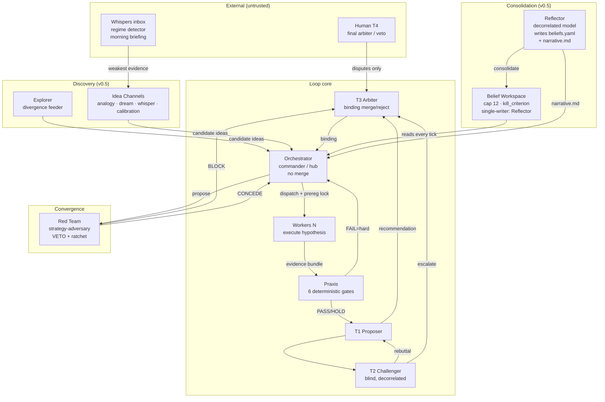
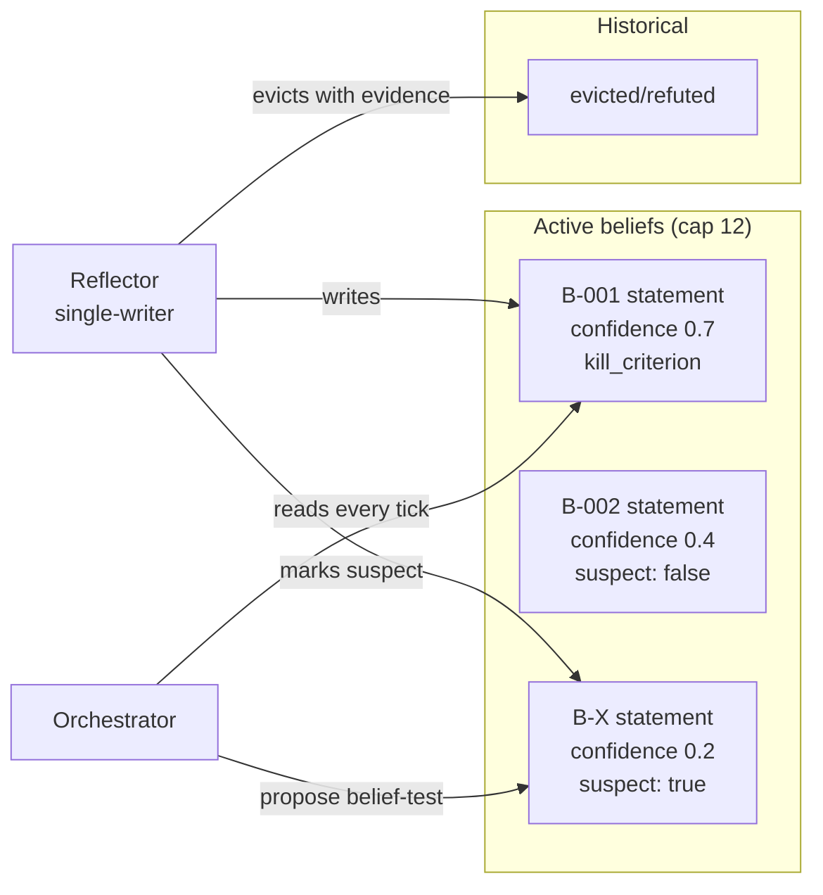
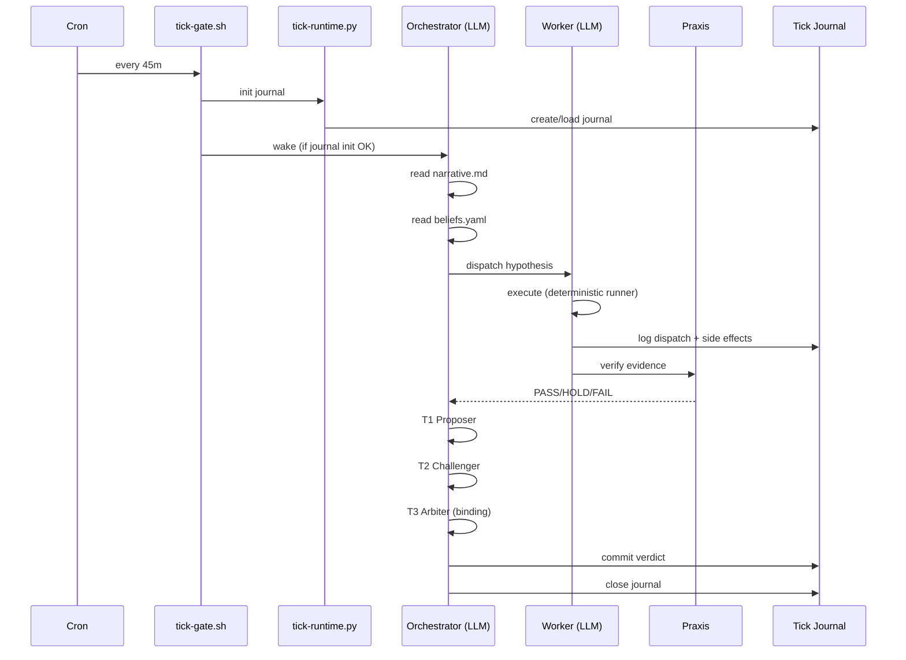

# Architecture

Hephaestus is a system of distinct roles, deterministic gates, and a shared belief
workspace. This page is the canonical reference; the org chart below appears in the README
and elsewhere.

## The org chart

## Roles

### Explorer (`templates/SOUL.worker.md` for divergence role)

The forward face of Janus. Generates divergent candidate ideas from cross-project
lessons, codebase scans, random mutations, and adjoint variants. **No veto, no merge
authority.** Runs on idle capacity, not every tick.

### Orchestrator (`templates/SOUL.orchestrator.md`)

The commander/hub. Reads `control.yaml` for mode/priority, dispatches workers, proposes
verdicts (T1). **Does not merge** — that authority moved to T3 Arbiter in v0.4 (#21) to
remove the orchestrator's conflict of interest.

### Workers

Execute bounded hypothesis-testing tasks on isolated branches. Each branch is one
hypothesis; one worker per branch. Output is deterministic JSON at
`$LEDGER/runs/<RUN_ID>.json`.

### Praxis Truth Kernel

Six deterministic gates. No LLM involved. Called via `tools/praxis-bridge.sh`. Schema →
Lock → Evidence → Wiring → Exec → Final.

### T1 Proposer / T2 Challenger / T3 Arbiter

LLM gates, but disciplined:

- **T1** — reads raw evidence, proposes verdict (PASS/HOLD/FAIL/PARTIAL)
- **T2** — blind (does not see T1's reasoning), decorrelated model family, ONE rebuttal
  round
- **T3** — reads raw evidence only, makes binding merge/reject decision. Never proposes,
  never writes code.

### Red Team (`templates/SOUL.redteam.md`)

A conditional meta-gate **above** T1/T2/T3, not a 4th permanent judge. Every objection
must carry a `retraction_criterion` — an objection with no stated way to be satisfied is
invalid. Persistent scar-tissue memory blocks re-litigating refuted hypotheses.

### Reflector (`templates/SOUL.reflector.md`) — v0.5

The third face. The missing explain/consolidate role. Three questions per run:

1. **Shared-assumption extraction** — "What unquestioned assumption do ALL recent failed
   hypotheses share?" → intersection of failures → frame-shift candidates. This is the
   mechanism that produces "grow the dataset" without ever enumerating axes in config.
2. **Relaxation probe** — "In an unconstrained world, how would we reach the goal — and
   which single constraint binds?" → shadow-price question → constraint-questioning ideas.
3. **Perspective tour** — "How would a data engineer / risk manager / skeptical funder
   read this?" → cheap lateral jumps.

**Hard rules:**

- Writes ONLY `beliefs.yaml` and `narrative.md`. Never code, never hypotheses, never merges.
- **Decorrelated model family** from orchestrator (else self-grading theater).
- Runs offline (idle capacity or plateau trigger), like human sleep consolidation.
- May mark at most ONE belief `suspect` per run.

### Idea Channels — v0.5

Four channels, all independently feature-flagged, default disabled, candidate-only
output. Disabled = zero spend, zero artifacts. See [v0.5 Kaizen Engine →](v05-kaizen.md).

## Deterministic gates

| Gate | Blocks | Cost | Phase |
|---|---|---|---|
| Schema | malformed evidence | $0 | Pre-Praxis |
| Lock | p-hacking (metric changed after seeing results) | $0 | Pre-Praxis |
| Evidence | claims without backing data | $0 | Praxis |
| Wiring | contracts not kept | $0 | Praxis |
| Exec | tests didn't actually run | $0 | Praxis |
| Final | acceptance criteria not met | $0 | Praxis |
| **Pre-registration lock** (#54) | post-hoc metric/threshold change | $0 | Pre-dispatch |
| **Self-grade diff** (#53) | orchestrator verdict > evidence supports | $0 | Post-Praxis, pre-T1 |
| **ROI/exploitation-throttle** (#29) | re-mining refuted family | $0 | Pre-dispatch |
| **Authority check** (#61) | undefined role-pair conflict | $0 | Pre-dispatch |
| **Suspect TTL** (#62) | permanent frame lockout | $0 | Pre-dispatch |
| **Channel budget** (#70) | overspend per channel/day | $0 | Pre-dispatch |
| **Tick journal** (#71) | duplicate side effects, lost writes | $0 | Every phase |

## The belief workspace

Hard rules:

- Capacity 12 active beliefs — capacity limit is the mechanism, not a nicety
- Every belief MUST carry `kill_criterion` (falsifiability contract — same pattern as
  Red Team objections)
- `blamed_by[]` tracks hypotheses that relied on this belief and died
- Eviction requires evidence (or its own `kill_criterion` triggered)
- Min-residency M=3 ticks before eviction allowed
- Entry is competitive — full capacity = new entry must evict

## Tick flow

## Invariants

These are enforced by the test suite — see `schema/tests/`:

1. **Praxis before T1** — no LLM gate runs before deterministic verification
2. **No evidence, no claim** — worker output without evidence is invalid
3. **Workers don't write memory** — only orchestrator after Praxis PASS + gate verdict
4. **Suspect beliefs block new in-frame hypotheses** — must test the belief or file to T3
5. **Reflector is single-writer of beliefs.yaml** — nobody else mutates
6. **Channel output is candidate-only** — never bypasses hypothesis validation
7. **Disabled channel = zero spend, zero artifacts** — feature flag is fail-closed
8. **Tick journal is idempotent** — same side-effect key applied twice = skipped

## What comes next

- [v0.5 Kaizen Engine →](v05-kaizen.md)
- [Schemas →](schemas.md)
- [Praxis Integration →](praxis.md)
