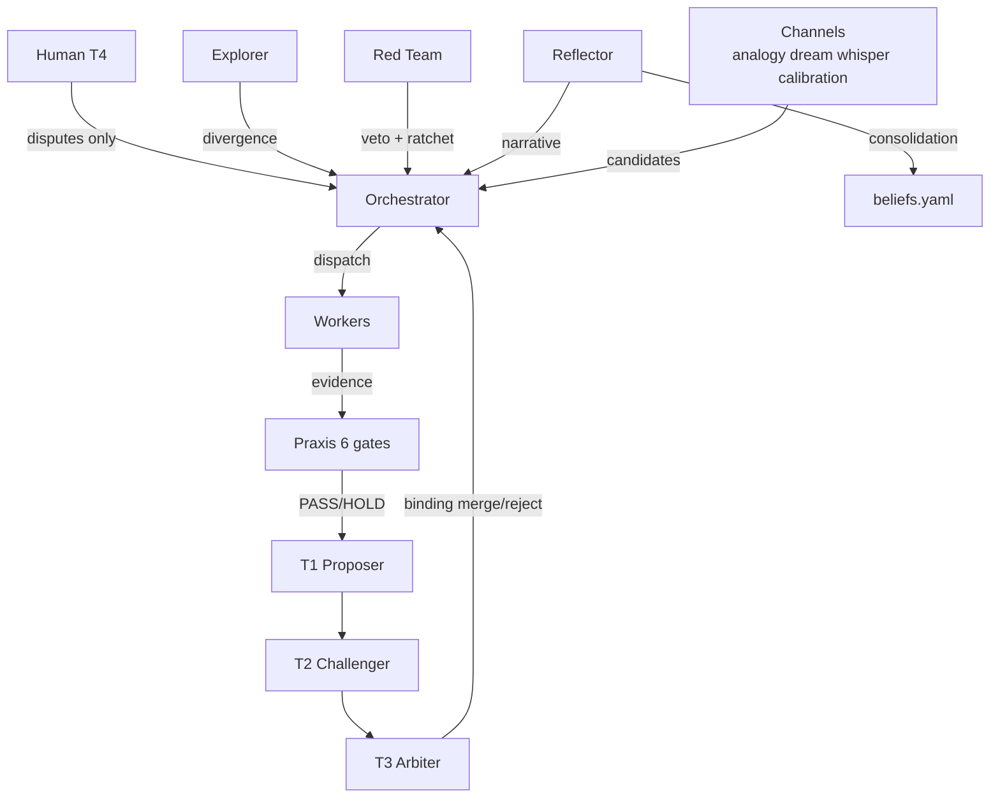

# Hephaestus

> **Explore freely. Prove ruthlessly.**

A generic, reusable bootstrap and orchestration package for [Hermes Agent](https://github.com/NousResearch/hermes-agent).
Turns any codebase into a hypothesis-driven, evidence-gated, autonomous improvement loop.

Formerly `hermes-pack`. Renamed to **Hephaestus** — the forge/automaton god — to give this
orchestration + verification layer its own identity, separate from the Hermes Agent runtime
it bootstraps.

-   :material-rocket-launch: **[Getting Started](getting-started.md)**

    One-liner install, bootstrap your first project in 60 seconds.

-   :material-graph: **[Architecture](architecture.md)**

    Roles, gates, channels, the org chart end-to-end.

-   :material-fire: **[v0.5 Kaizen Engine](v05-kaizen.md)**

    Reflector, belief workspace, four idea channels, containment.

-   :material-cog: **[Adapters](adapters.md)**

    Project-specific config — AlphaForge, DesignForge, MoneyRadar.

-   :material-shield-check: **[Praxis Integration](praxis.md)**

    How the Truth Kernel gates LLM judgment.

-   :material-history: **[Changelog](changelog.md)**

    Release history — v0.5.0-kaizen is current.

## What is Hephaestus?

Hephaestus is a **loop**: dispatch hypothesis → execute → verify → judge → merge/reject →
learn → repeat. The loop is:

- **Hypothesis-driven** — every change traces to a falsifiable claim
- **Evidence-gated** — Praxis Truth Kernel verifies all evidence before LLM judgment
- **Autonomous** — runs on cron, no human required for routine operations
- **Self-improving** — v0.5 adds a third face (Reflector) that consolidates and rewrites
  the system's shared beliefs, plus four idea channels (analogy, dream, whisper, calibration)
  that supply diversity at volume
- **Crash-safe** — durable tick transaction journal, idempotent operations, recoverable
  after partial failures
- **Multi-project** — all projects share one Hermes instance with unique namespacing

## Architecture at a glance

## Project status

| Component | Status |
|---|---|
| Bootstrap (bash + Bun/TS) | ✅ shipped |
| Schema contract (state/control/goal/ideas/events) | ✅ shipped |
| Praxis Truth Kernel integration | ✅ shipped |
| T0/T1/T2/T3 evidence-gated pipeline | ✅ shipped |
| Red Team + scar-tissue memory | ✅ shipped |
| Provider-chain decorrelation | ✅ shipped |
| v0.4 hard rules: escalation, AFK, ROI, curiosity | ✅ shipped |
| **v0.5 Kaizen Engine** (Reflector + beliefs + channels + containment + journal) | ✅ shipped ([release](https://github.com/ddawnlll/hephaestus/releases/tag/v0.5.0-kaizen)) |

## Why "Hephaestus"?

In mythology, Hephaestus is the forge god — the divine automator who builds helpers out of
metal. He is also the only Olympian who works rather than commands. That's the loop: the
system *forges* improvements, it doesn't merely order them.

The motto — **"Explore freely. Prove ruthlessly."** — captures the tension. The Explorer
generates candidates without veto power; the Red Team + Praxis reject anything that cannot
pass deterministic evidence gates. The two faces are necessary, neither is sufficient.

## License

MIT — see repository root.
