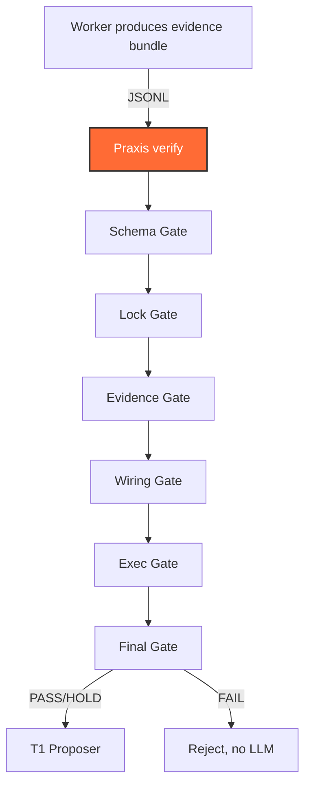
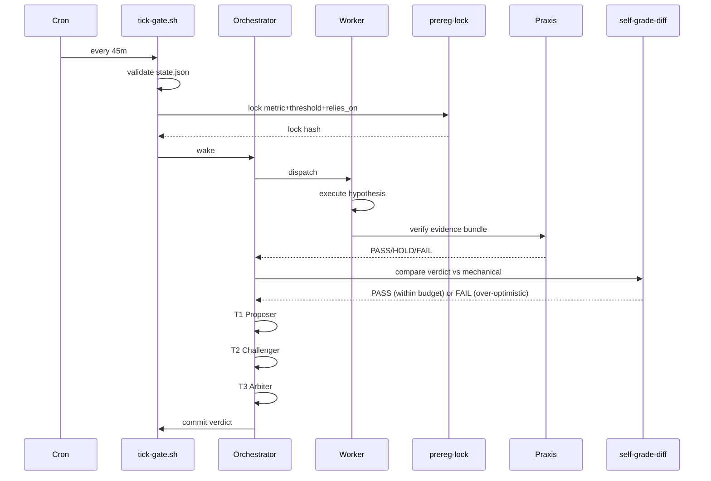

# Praxis Truth Kernel Integration

Hephaestus integrates with the **[Praxis Truth Kernel](https://github.com/ddawnlll/praxis)**
(`ddawnlll/praxis`) — an independent, deterministic verification layer for agent
outputs. Praxis is **not** reimplemented here; it lives in its own repo and is called
as a CLI tool via `tools/praxis-bridge.sh`.

## Architecture



All six gates are **deterministic** — no LLM involved. The same philosophy as Praxis,
applied to evidence-rigor instead of strategy-rigor.

## Six gates

| # | Gate | Blocks |
|---|---|---|
| 1 | **Schema** | malformed evidence (file missing, wrong format) |
| 2 | **Lock** | plan integrity — hash mismatch, missing lock |
| 3 | **Evidence** | claims without backing data, citation gaps |
| 4 | **Wiring** | contracts not kept — output not at expected path |
| 5 | **Exec** | tests didn't actually run (missing output, suspicious timing) |
| 6 | **Final** | acceptance criteria not met (objective check) |

## PlanSpec + evidence bundle

Praxis expects a PlanSpec and an evidence ledger:

```yaml
# .praxis/v05-planspec.yaml
planSpecVersion: "0.1.0"
kind: "ImplementationPlan"
profile: "praxis-v0.1"
metadata:
  planId: "HEPHAESTUS-V05-KAIZEN-ENGINE"
  status: "complete"
authority:
  executor: "autonomous-agent"
  completionAuthority: "PraxisTruthKernel"
tasks:
  - id: "task-schema-core"
    title: "Schema Core (#56, #58, #69, #60)"
    objective: "beliefs.yaml workspace, relies_on + provenance, stagnation/momentum"
    acceptanceCriteria:
      - "beliefs.schema.json has maxItems=12 for active workspace"
      - "historical_beliefs array exists for evicted/refuted beliefs"
      - "Every belief has mandatory kill_criterion"
      - "hypothesis.schema.json requires relies_on field"
```

```jsonl
# .praxis/runs/v05-full-evidence.jsonl
{"recordId": "EV-V05-001", "type": "source", "taskId": "task-schema-core", "summary": "schema/beliefs.schema.json: maxItems=12", "paths": ["schema/beliefs.schema.json"]}
{"recordId": "EV-V05-002", "type": "test_output", "taskId": "task-schema-core", "summary": "Test suite: ~194 tests, 0 failed across 8 suites", "paths": []}
```

## The bridge

`tools/praxis-bridge.sh` is a thin wrapper that finds the Praxis CLI and forwards
arguments:

```bash
# Verify
bash tools/praxis-bridge.sh verify --plan .praxis/v05-planspec.yaml

# Plan validate
bash tools/praxis-bridge.sh plan-validate --plan .praxis/v05-planspec.yaml

# Status
bash tools/praxis-bridge.sh status

# Report
bash tools/praxis-bridge.sh report <run-id>

# Lock (create/verify)
bash tools/praxis-bridge.sh plan-lock --plan .praxis/v05-planspec.yaml
```

Exit codes follow Praxis convention:

- `0` = PASS — all gates passed
- `1` = HOLD — some gates held
- `2` = FAIL — gates failed
- `3` = error (praxis CLI not found, etc.)

## Adapter-level Praxis config

Each adapter's `project.yaml` has a `praxis:` block:

```yaml
praxis:
  plan_path: ".praxis/plan.yaml"
  evidence_dir: ".praxis/runs"
  auto_verify_on_dispatch: true
  fail_closed: true
  max_repair_loops: 0
```

## Hephaestus's own internal gates

In addition to the external Praxis six gates, Hephaestus has its own deterministic gates
(see [Architecture →](architecture.md#deterministic-gates)):

| Gate | Added in | Purpose |
|---|---|---|
| Pre-registration lock | v0.4 #27 | metric/threshold changed after seeing results = p-hacking |
| Self-grade diff | v0.4 #28 | orchestrator verdict > raw evidence supports |
| ROI / exploitation-throttle | v0.4 #29 | re-mining a refuted hypothesis family |
| Authority check | v0.5 #61 | undefined role-pair conflict |
| Suspect TTL | v0.5 #62 | permanent frame lockout |
| Channel budget | v0.5 #70 | overspend per channel/day |
| Tick journal | v0.5 #71 | duplicate side effects, lost writes |

All run BEFORE Praxis in the tick pipeline — gates are layered, not duplicated.

## Why externalize Praxis?

Three reasons:

1. **Independent verification** — Praxis is its own repo, its own tests, its own
   release cadence. If Praxis has a bug, Hephaestus can pin a specific version.
2. **Reusability** — Praxis is used by other projects in the ddawnlll ecosystem
   (hermes-pack, alphaforge-infa, designforge). One implementation, many consumers.
3. **No drift** — Hephaestus is a meta-system that orchestrates other tools. It
   *should* call those tools via CLI, not reimplement them.

## Flow



## Reference

- Praxis Truth Kernel: <https://github.com/ddawnlll/praxis>
- Bridge: [`tools/praxis-bridge.sh`](https://github.com/ddawnlll/hephaestus/blob/main/tools/praxis-bridge.sh)
- v0.5 evidence bundle: [`.praxis/runs/v05-full-evidence.jsonl`](https://github.com/ddawnlll/hephaestus/blob/v0.5.0-kaizen/.praxis/runs/v05-full-evidence.jsonl)
- v0.5 PlanSpec: [`.praxis/v05-planspec.yaml`](https://github.com/ddawnlll/hephaestus/blob/v0.5.0-kaizen/.praxis/v05-planspec.yaml)
